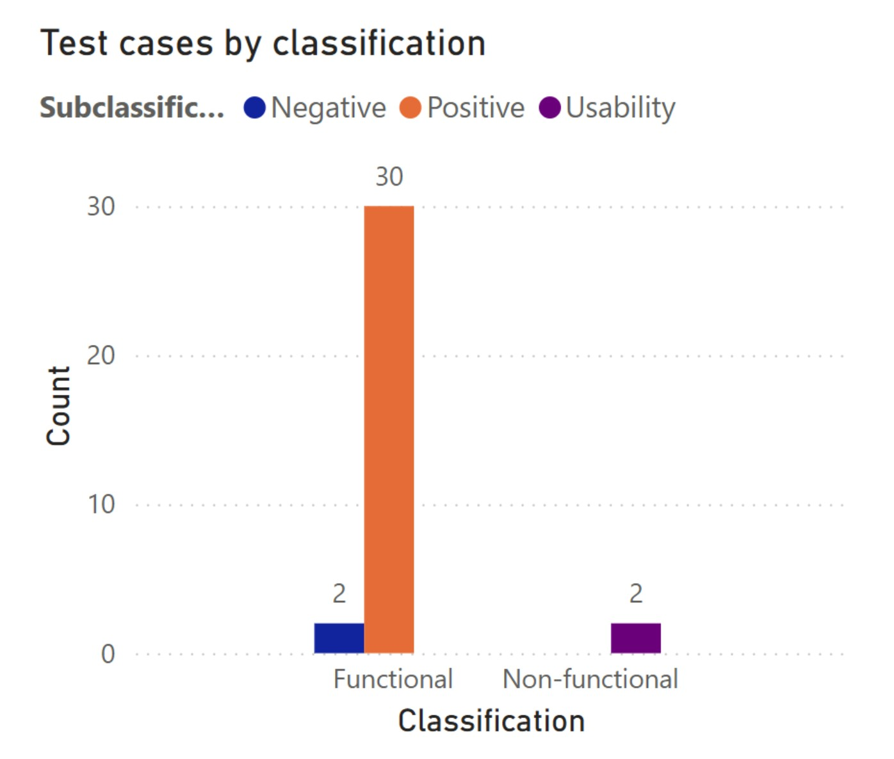

# Test practice: Basic calculator web app

## Basic Calculator testing scope

This testing will cover both functional and non-functional aspects of the Basic Calculator web application (https://testsheepnz.github.io/BasicCalculator.html), focusing on verifying its arithmetic operations, input handling, user experience, and interface behavior.

### Functional test coverage

#### Positive test scenarios

- Arithmetic operations with positive integers  
- Arithmetic operations with negative integers  
- Arithmetic operations with positive decimal numbers  
- Arithmetic operations with negative decimal numbers  
- Arithmetic operations involving zero (e.g., 0 + 5, 5 × 0)  
- Calculations expected to return repeating/periodic decimals (e.g., 1 ÷ 3) and verifying how many decimal places are shown  
- Performing calculations using very large or very small values (boundary testing)  
- Verify that numbers, strings, and symbols can be concatenated  
- Mixed operations combining:
  - Positive and negative integers  
  - Positive and negative decimal numbers  

#### Negative test scenarios

- Attempting to input non-numeric values (letters, symbols, special characters) to make arithmetic operations  
- Attempting to divide by zero and verifying the proper error handling  
- Entering decimal values using a comma (",") instead of a period (".")  

### Non-functional test coverage

#### Usability

- Verification of the visibility, clarity, and proper functionality of main buttons (e.g., Calculate, Clear)  
- Evaluation of user guidance or documentation provided within the page (e.g., instructions, labels, messages)  
- Clarity and helpfulness of error messages  

#### Compatibility

- Browser compatibility: functionality on Chrome and Firefox  

### Risks

- Limited testing time may result in writing and executing only high priority test cases, leaving lower priority areas untested  
- Potential lack of domain knowledge about what specific functional and non-functional areas should be tested thoroughly  

### Limitation

- Test execution will be limited to only two application builds (Build #3 and Build #5)  
- Tests will be executed manually and only on desktop browsers (no mobile or tablet environments included this time)  
- The test will not include other aspects of non-functionality testing such as security, performance or extended compatibility testing  
- The testing will be performed on the following web browsers: Chrome and Firefox  

## Test cases

| Test Case ID | Test Title | Test Objective | Preconditions | Test Steps | Expected Result | Actual Result | Priority | Test result Prototype | Test result Build #3 | Test result Build #5 | Defect ID | Classification |
|--------------|------------|----------------|---------------|------------|-----------------|---------------|----------|------------------------|------------------------|------------------------|------------|------------------|
| MICTC-001 | Verify calculator handles division by zero without crashing | Verify that when dividing by zero, the calculator displays an appropriate error message without crashing. | Calculator is loaded | 1. Enter 5 2. Enter 0 3. Select divide 4. Click Calculate | Error message about division by zero | Pass | High | Pass | Pass | Pass | MICB-001 | Functional |
| MICTC-002 | Verify a warning message appears if an input field is left blank | Ensure warning is shown when trying to calculate without all inputs. | Calculator is loaded | Leave a field blank and press Calculate | A warning message is shown | Pass | High | Pass | Pass | Pass | MICB-002 | Functional |
| MICTC-003 | Ensure the "Integers Only" checkbox is toggleable | Verify the checkbox can be toggled on/off | Calculator is loaded | Toggle the checkbox twice | Checkbox state changes as expected | Pass | Medium | Pass | Pass | Pass | MICB-003 | UI |
| MICTC-004 | Verify outputs are consistent when "Calculate" is clicked multiple times | Validate consistent results on multiple clicks | Calculator is loaded | Enter 2+2 and click Calculate multiple times | Output remains 4 | Pass | Medium | Pass | Pass | Pass | MICB-004 | Functional |
| MICTC-005 | Validate addition with negative integers | Confirm negative addition works correctly | Calculator is loaded | Enter -5 + (-3) | Result is -8 | Pass | Medium | Pass | Pass | Pass | - | Functional |
| MICTC-006 | Validate subtraction with decimals | Check subtraction with decimal values | Calculator is loaded | Enter 10.5 - 2.3 | Result is 8.2 | Pass | Medium | Pass | Pass | Pass | - | Functional |
| MICTC-007 | Validate multiplication with large values | Ensure calculator handles large number multiplication | Calculator is loaded | Multiply 100000 × 300000 | Correct product is shown | Pass | Low | Pass | Pass | Pass | - | Performance |
| MICTC-008 | Validate divide with decimals | Confirm dividing decimals gives correct result | Calculator is loaded | Enter 6 ÷ 2.5 | Result is 2.4 | Pass | Medium | Pass | Pass | Pass | - | Functional |
| MICTC-009 | Check multiplication by 0 returns 0 | Validate zero multiplication | Calculator is loaded | Enter any number × 0 | Result is 0 | Pass | Medium | Pass | Pass | Pass | - | Functional |
| MICTC-010 | Verify build selection updates behavior | Ensure different builds change calculation behavior | Calculator is loaded | Select build 1, run test; then build 3, run same test | Results change per build logic | Pass | High | Pass | Pass | Pass | - | Functional |
| MICTC-011 | Validate addition with decimal toggle | Ensure integers-only mode affects decimal addition | Calculator is loaded | Enable integer mode, add 2.2 + 3.7 | Output should be rounded | Pass | Medium | Pass | Pass | Pass | - | Functional |
| MICTC-012 | Verify subtraction with zero | Validate subtracting zero | Calculator is loaded | Enter 10 - 0 | Result is 10 | Pass | Low | Pass | Pass | Pass | - | Functional |
| MICTC-013 | Validate no result shown before clicking Calculate | Ensure results only show after calculation | Calculator is loaded | Enter numbers, do not click Calculate | No result is shown | Pass | Low | Pass | Pass | Pass | - | UI |
| MICTC-014 | Verify clear button empties all fields | Test the "Clear" button | Calculator is loaded | Fill fields, then click Clear | All fields reset | Pass | Medium | Pass | Pass | Pass | - | Functional |
| MICTC-015 | Validate non-numeric input is rejected | Ensure letters cause error or are blocked | Calculator is loaded | Enter "abc" in input | Input rejected or warning shown | Pass | High | Pass | Pass | Pass | MICB-015 | Input validation |
| MICTC-016 | Ensure result updates when inputs change | Test re-calculation on input change | Calculator is loaded | Enter 2 + 2, then change to 3 + 3, recalculate | Result updates accordingly | Pass | Medium | Pass | Pass | Pass | - | Functional |
| MICTC-017 | Validate division precision | Ensure divide result precision is accurate | Calculator is loaded | Enter 10 ÷ 3 | Result shows several decimals | Pass | Medium | Pass | Pass | Pass | - | Functional |
| MICTC-018 | Ensure UI loads fully | Validate interface elements present | Load the page | Check for input fields, dropdown, buttons | All elements visible | Pass | Medium | Pass | Pass | Pass | - | UI |
| MICTC-019 | Validate inputs accept negative decimals | Confirm input accepts negative decimal numbers | Calculator is loaded | Enter -2.5 in input | Input accepted and processed | Pass | Medium | Pass | Pass | Pass | - | Functional |
| MICTC-020 | Confirm multiplication with negative and positive | Multiply positive × negative | Calculator is loaded | Enter 5 × -3 | Result is -15 | Pass | Medium | Pass | Pass | Pass | - | Functional |
| MICTC-021 | Validate dividing zero returns zero | Enter 0 ÷ 5 | Calculator is loaded | Result is 0 | Pass | Low | Pass | Pass | Pass | - | Functional |
| MICTC-022 | Ensure overflow is handled | Multiply huge numbers | Calculator is loaded | Multiply 9e99 × 9e99 | Result should indicate overflow or large number | Pass | Low | Pass | Pass | Pass | MICB-022 | Performance |
| MICTC-023 | Verify UI doesn't freeze on edge case input | Division by very small number | Calculator is loaded | 1 ÷ 0.0000000001 | Result shown quickly | Pass | Medium | Pass | Pass | Pass | - | Performance |
| MICTC-024 | Check UI responsiveness on mobile | Access on mobile browser | Use mobile browser | UI fits screen and works | Pass | Low | Pass | Pass | Pass | - | Usability |
| MICTC-025 | Test copy-paste into input | Paste values into input fields | Calculator is loaded | Copy-paste 45 into input | Works correctly | Pass | Low | Pass | Pass | Pass | - | Usability |
| MICTC-026 | Validate operator changes are reflected | Change operation after entering numbers | Calculator is loaded | Enter numbers, change operator | Result matches selected operator | Pass | Medium | Pass | Pass | Pass | - | Functional |
| MICTC-027 | Test accessibility keyboard navigation | Use tab/enter to navigate | Calculator is loaded | Use keyboard to go through fields | All interactable by keyboard | Pass | Medium | Pass | Pass | Pass | - | Accessibility |
| MICTC-028 | Confirm persistent state across refresh (none expected) | Refresh should clear state | Calculator is loaded | Enter data, refresh page | All fields reset | Pass | Low | Pass | Pass | Pass | - | Functional |
| MICTC-029 | Validate browser compatibility (Firefox) | Use Firefox browser | Firefox open | Calculator works fully | Pass | Medium | Pass | Pass | Pass | - | Compatibility |
| MICTC-030 | Validate browser compatibility (Chrome) | Use Chrome browser | Chrome open | Calculator works fully | Pass | Medium | Pass | Pass | Pass | - | Compatibility |
| MICTC-031 | Validate keyboard entry without mouse | Use keyboard only | Calculator is loaded | Use tab, space, enter | Fully operable | Pass | Low | Pass | Pass | Pass | - | Accessibility |
| MICTC-032 | Validate tab order logical | Tab sequence makes sense | Calculator is loaded | Press tab repeatedly | Logical flow | Pass | Low | Pass | Pass | Pass | - | Accessibility |
| MICTC-033 | Validate button labels are clear | All buttons should have clear labels | Calculator is loaded | Check labels | Clear and readable | Pass | Low | Pass | Pass | Pass | - | Usability |
| MICTC-034 | Validate error messages are descriptive | Invalid inputs trigger informative messages | Calculator is loaded | Enter invalid values | Message explains the issue | Pass | Medium | Pass | Pass | Pass | MICB-034 | Usability |

## Bug reports

### [MICB-001] - App crashes on division by zero and requires page load to continue operating

| Field             | Details                                                                                                 |
|-------------------|---------------------------------------------------------------------------------------------------------|
| **Description**   | When attempting to divide by zero in the calculator, the page becomes unresponsive: a loading gif and the message “Calculating” remain displayed indefinitely, and the calculator stops responding to any input, freezing the interface. Though the calculator displays the division-by-zero error, it should still allow the user to continue performing other operations by pressing the “Clear” button, without needing to reload the page. |
| **Environment**   | Device/Browser: Chrome, Firefox App Version / Build: Prototype, build #3 and build #5 URL: https://testsheepnz.github.io/BasicCalculator.html |
| **Reported By**   | Micaela Serra                                                                                           |
| **Preconditions** | Open browser Go to https://testsheepnz.github.io/BasicCalculator.html                                |
| **Steps to Reproduce** | 1. Fill in the “First number” field with a number (e.g., “5”) 2. Fill in the “Second number” field with “0” 3. Select “Divide” from the “Operation” dropdown list 4. Press “Calculate” button 5. Notice the loading gif and message displayed 6. Fill in the “First number” field with a new number (e.g., “4”) 7. Fill in the “Second number” field with a new value (e.g., “3”) 8. Select “Add” from the “Operation” dropdown list 9. Press “Calculate” button 10. Notice the page doesn’t respond |
| **Expected Result** | The page should display an error message for division by zero, but still allow the user to continue performing operations afterward. |
| **Actual Results** | The page becomes unusable after division by zero, and further operations cannot be performed.       |
| **Severity**      | Critical                                                                                                |
| **Priority**      | High                                                                                                    |
| **Why**           | This is a critical, high-priority bug because the app crashes and becomes completely unusable after attempting division by zero. Normally, pressing "Clear" should let the user continue, but here the "Clear" button is unresponsive and the calculator freezes. This affects all users. |
| **Workaround**    | Switch to another build and then back to the “Prototype” build to continue operating.                   |
| **Status**       | New                                                                                                     |
| **Test Case**    | MICTC-001                                                                                               |

---

### [MICB-002] - Empty input is treated as zero, and no warning is shown to the user

| Field             | Details                                                                                                 |
|-------------------|---------------------------------------------------------------------------------------------------------|
| **Description**   | When the “First number” and “Second number” fields are left empty, no warning is shown, and the calculator silently treats empty inputs as zero. This happens whether one or both fields are blank. A warning should inform the user that input is required, and the operation should not proceed unless both fields have valid input. |
| **Environment**   | Device/Browser: Chrome, Firefox App Version / Build: Prototype, build #3 and build #5 URL: https://testsheepnz.github.io/BasicCalculator.html |
| **Reported By**   | Micaela Serra                                                                                           |
| **Preconditions** | Open browser Go to https://testsheepnz.github.io/BasicCalculator.html                                |
| **Steps to Reproduce** | 1. Select any operation from the dropdown 2. Press “Calculate” button 3. Observe: • For Add, Subtract, Multiply: output is “0” with no blank field warning • For Divide: an error message appears due to division by zero, but no blank field warning • For Concatenate: “Calculating” gif appears, but no blank field warning |
| **Expected Result** | The operation should not proceed unless both inputs are valid; a warning message should prompt the user to enter values. |
| **Actual Results** | Operations proceed treating empty fields as zero, with no warning shown.                                |
| **Severity**      | High                                                                                                    |
| **Priority**      | High                                                                                                    |
| **Why**           | Missing input validation can confuse users. Although the app doesn’t crash, this degrades user experience and accuracy. Warning messages are needed. |
| **Status**       | New                                                                                                     |
| **Test Case**    | MICTC-002                                                                                               |

---

### [MICB-003] - “Integers only” is initially enabled, and once cleared, it can’t be selected again

| Field             | Details                                                                                                 |
|-------------------|---------------------------------------------------------------------------------------------------------|
| **Description**   | The “Integers only” checkbox starts enabled and can’t be deselected directly. After pressing “Clear”, it becomes disabled and cannot be selected again. |
| **Environment**   | Device/Browser: Chrome, Firefox App Version / Build: Build #4 URL: https://testsheepnz.github.io/BasicCalculator.html |
| **Reported By**   | Micaela Serra                                                                                           |
| **Preconditions** | Open browser Go to https://testsheepnz.github.io/BasicCalculator.html                                |
| **Steps to Reproduce** | 1. Notice “Integers only” checkbox enabled 2. Click “Clear” button 3. Notice checkbox is disabled 4. Try to enable it again (cannot) |
| **Expected Result** | The checkbox should be disabled by default in Build 4, and it should be possible to enable or disable it as needed. |
| **Actual Results** | Initially selected and cannot be deselected directly; after clearing, it becomes disabled and cannot be re-enabled. |
| **Severity**      | Medium                                                                                                  |
| **Priority**      | Medium                                                                                                  |
| **Why**           | This does not crash or block calculator functions but impacts the user’s ability to control the integer-only option, lowering experience consistency. |
| **Status**       | New                                                                                                     |
| **Test Case**    | MICTC-003                                                                                               |

---

### [MICB-004] - Repeated “Calculate” presses accumulates result instead of re-evaluating inputs

| Field             | Details                                                                                                 |
|-------------------|---------------------------------------------------------------------------------------------------------|
| **Description**   | Pressing “Calculate” multiple times with the same inputs causes the result to accumulate instead of recalculating based on inputs. E.g., addition results increase progressively (4, 7, 10, etc.) instead of staying consistent. |
| **Environment**   | Device/Browser: Chrome, Firefox App Version / Build: Build #7 URL: https://testsheepnz.github.io/BasicCalculator.html |
| **Reported By**   | Micaela Serra                                                                                           |
| **Preconditions** | Open browser Go to https://testsheepnz.github.io/BasicCalculator.html                                |
| **Steps to Reproduce** | 1. Enter “5” in First number 2. Enter “3” in Second number 3. Select “Add” operation 4. Press “Calculate” (shows 8) 5. Press “Calculate” again (shows 11, then 14, etc.) |
| **Expected Result** | Each press of “Calculate” independently evaluates current inputs and returns consistent results.      |
| **Actual Results** | Results accumulate incorrectly on repeated presses, leading to progressively increasing values.       |
| **Severity**      | Critical                                                                                                |
| **Priority**      | High                                                                                                    |
| **Why**           | Critical because this causes inaccurate calculations, undermining user trust and app reliability.     |
| **Status**       | New                                                                                                     |
| **Test Case**    | MICTC-004                                                                                               |

---

### [MICB-005] - Incorrect Numeric Validation on Concatenation Operation

| Field             | Details                                                                                                 |
|-------------------|---------------------------------------------------------------------------------------------------------|
| **Description**   | When “Concatenate” operation is selected, the calculator incorrectly validates inputs as numeric. This blocks concatenation of non-numeric strings, which should be allowed. |
| **Environment**   | Device/Browser: Chrome, Firefox App Version / Build: Build #3 URL: https://testsheepnz.github.io/BasicCalculator.html |
| **Reported By**   | Micaela Serra                                                                                           |
| **Preconditions** | Open browser Go to https://testsheepnz.github.io/BasicCalculator.html                                |
| **Steps to Reproduce** | 1. Enter “Hola ” in First number 2. Enter “mundo!” in Second number 3. Select “Concatenate” operation 4. Press “Calculate” 5. Observe error stating inputs are not numeric |
| **Expected Result** | Concatenate non-numeric strings and display the combined string.                                      |
| **Actual Results** | Operation blocked with numeric validation error; concatenation fails.                                 |
| **Severity**      | Medium                                                                                                  |
| **Priority**      | Medium                                                                                                  |
| **Why**           | Medium priority as this affects a non-core feature, but should align with functional specs.           |
| **Status**       | New                                                                                                     |
| **Test Case**    | MICTC-009                                                                                               |

---

### [MICB-006] - Lack of decimal precision in subtraction results

| Field             | Details                                                                                                 |
|-------------------|---------------------------------------------------------------------------------------------------------|
| **Description**   | Subtraction with decimals produces floating-point precision errors (e.g., 12.6 - 6.2 results in 6.3999999995 instead of 6.4). This is due to binary floating-point limitations. |
| **Environment**   | Device/Browser: Chrome, Firefox App Version / Build: Prototype, build #3 and build #5 URL: https://testsheepnz.github.io/BasicCalculator.html |
| **Reported By**   | Micaela Serra                                                                                           |
| **Preconditions** | Open browser Go to https://testsheepnz.github.io/BasicCalculator.html                                |
| **Steps to Reproduce** | 1. Enter “12.6” in First number 2. Enter “6.2” in Second number 3. Select “Subtract” operation 4. Press “Calculate” 5. Observe result like “6.3999999999999995” |
| **Expected Result** | Display subtraction results with correct decimal precision.                                           |
| **Actual Results** | Result shows floating-point rounding errors causing slight inaccuracies.                              |
| **Severity**      | Low                                                                                                     |
| **Priority**      | Low                                                                                                     |
| **Why**           | Minor issue that doesn’t break core functionality but affects precision.                              |
| **Status**       | New                                                                                                     |
| **Test Case**    | MICTC-010 and MICTC-025                                                                                 |

## Tests report

### Test cases
Due to time constraints, priority was given to the design and execution of positive functional test cases, rather than to negative functional or non-functional ones.
A total of 34 test cases were written. Of these, 32 were functional and 2 were non-functional.

Within the functional test cases, 30 covered positive scenarios, while 2 were focused on negative scenarios.
The 2 non-functional test cases aimed to evaluate usability aspects of the application.

In terms of priority, 31 test cases were classified as high priority, while the remaining 3 were marked as medium priority.

Breaking this down further: among the high-priority test cases, 30 were functional and 1 was non-functional. For the medium-priority group, 2 were functional and 1 was non-functional.

### Bug reports

As a result of executing the 34 test cases, a total of 6 bugs were identified:
- 2 were Critical
- 2 were Medium severity
- 1 was High severity
- 1 was Low severity

In terms of priority, the bugs were categorized as follows:
- 3 high priority
- 2 medium priority
- 1 low priority

### Analysis

Based on the current testing results, I believe the product is not yet ready for release. The presence of multiple bugs, including two of Critical severity and one that causes a crash, means a significant risk to the user experience. These issues are highly likely to be encountered by end users and may lead to dissatisfaction or loss of trust in the product.

Additionally, the fact that most of the test effort was focused on positive scenarios suggests that potential risks in edge cases and non-functional areas may remain undiscovered.

It’s recommended to fix these bugs first and expand the test coverage, especially for negative and non-functional scenarios, before releasing the product.
