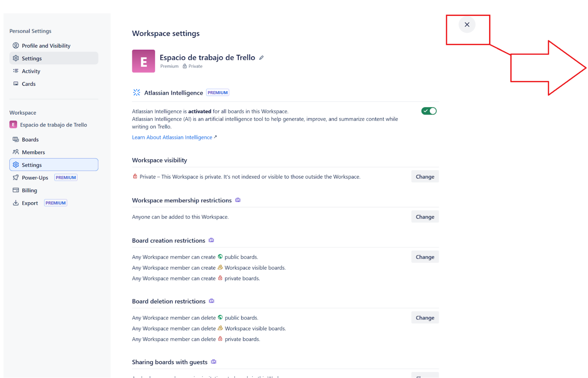
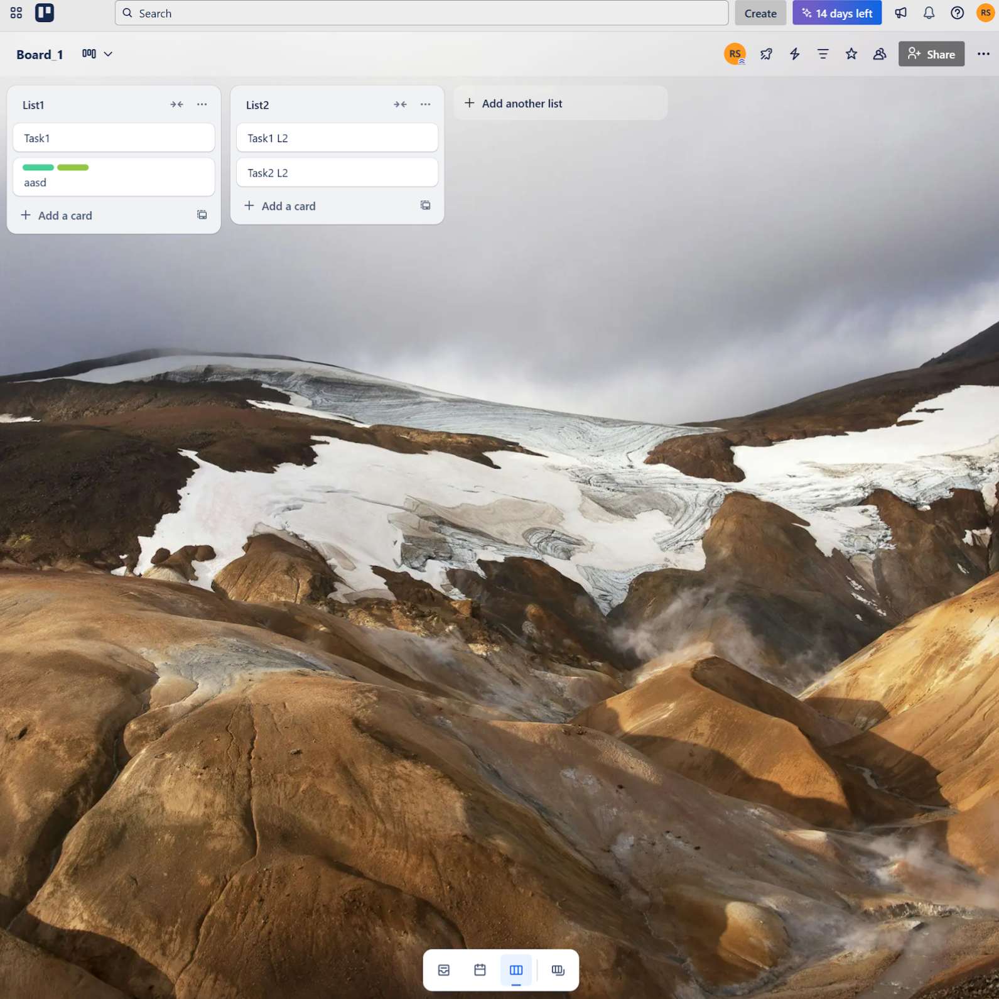
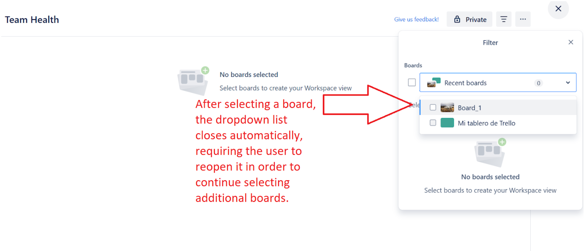
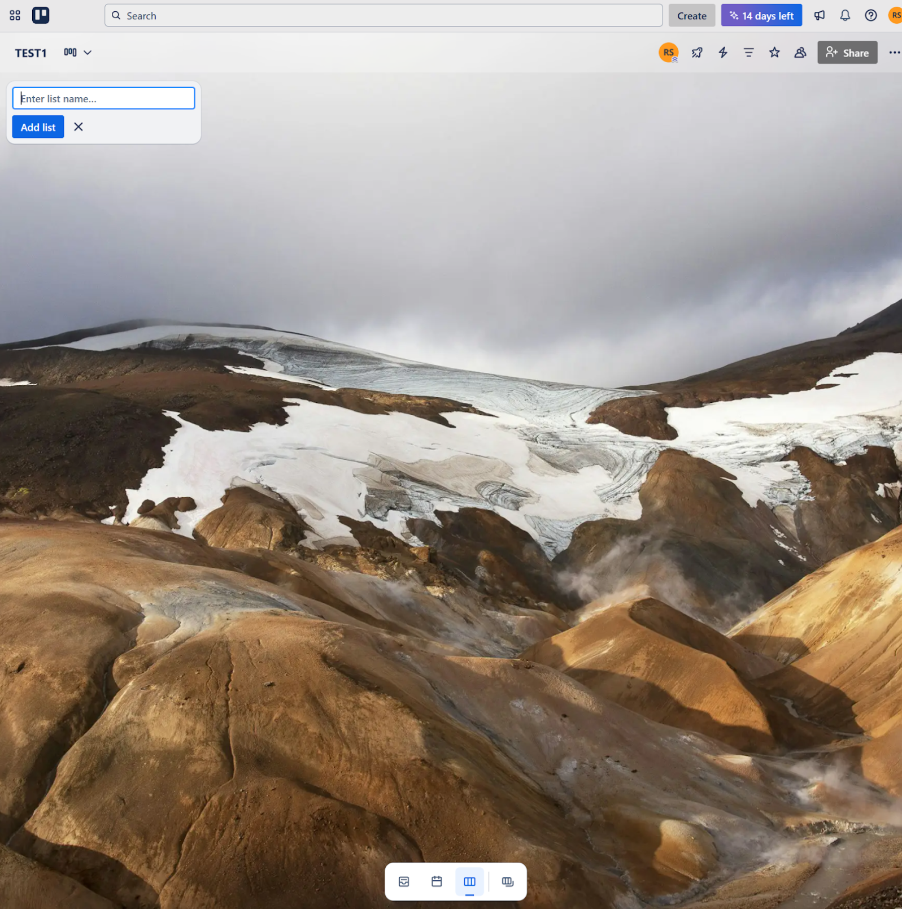
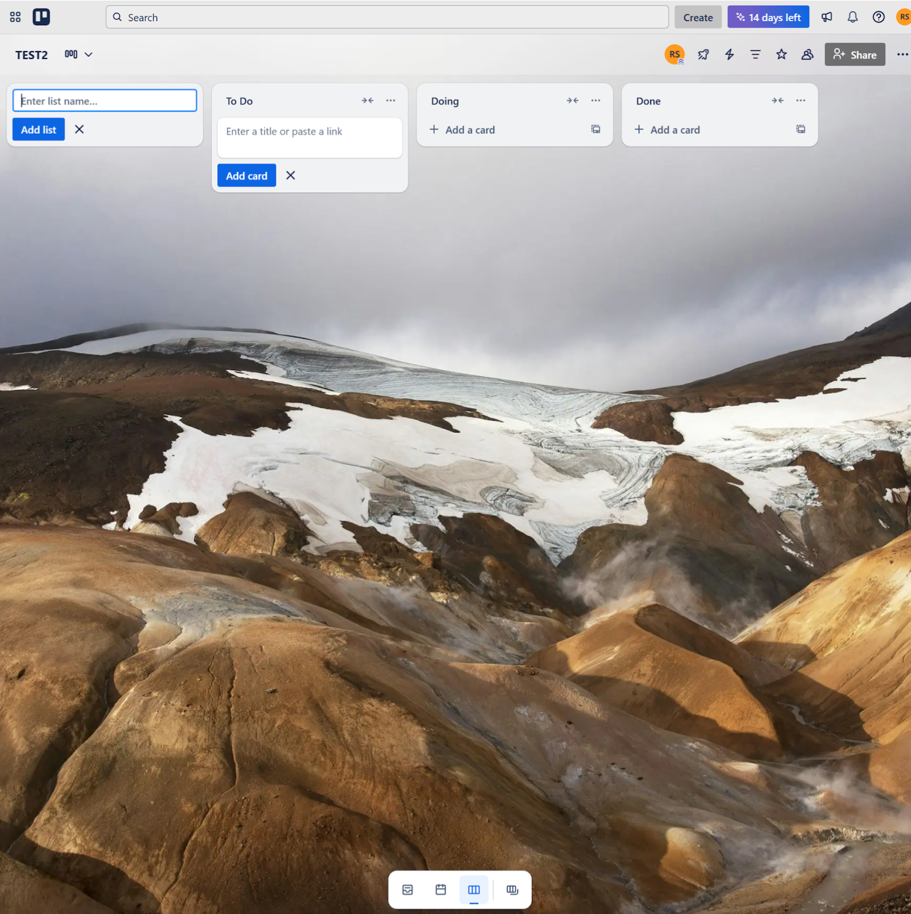

# End-to-end low level test cases for Trello web app

## Table of contents

1. [Test cases](#1-test-cases)

    1.1 [LLTC-01: Verify that a user can log in, move a card between different lists on an existing board, and confirm that the change persists after logout and login](#lltc-01-verify-that-a-user-can-log-in-move-a-card-between-different-lists-on-an-existing-board-and-confirm-that-the-change-persists-after-logout-and-login)  
    1.2 [LLTC-02: Verify that a user can log in, create a board with lists and cards in a workspace, and delete the board along with all its contents properly](#lltc-02-verify-that-a-user-can-log-in-create-a-board-with-lists-and-cards-in-a-workspace-and-delete-the-board-along-with-all-its-contents-properly)  
    1.3 [LLTC-03: Verify that changes made to a card are saved after exiting and reopening the board](#lltc-03-verify-that-changes-made-to-a-card-are-saved-after-exiting-and-reopening-the-board)  
    1.4 [LLTC-04: Verify that user can navigate from Home to Workspace Settings and return to Home successfully](#lltc-04-verify-that-user-can-navigate-from-home-to-workspace-settings-and-return-to-home-successfully)  
    1.5 [LLTC-05: Verify that a user can add and edit a label on a card and that the changes persist after refreshing the page](#lltc-05-verify-that-a-user-can-add-and-edit-a-label-on-a-card-and-that-the-changes-persist-after-refreshing-the-page)  
    1.6 [LLTC-06: Verify that a user can create a workspace view by entering only a name, configure it by selecting two boards through the filters panel, close it, and access it again](#lltc-06-verify-that-a-user-can-create-a-workspace-view-by-entering-only-a-name-configure-it-by-selecting-two-boards-through-the-filters-panel-close-it-and-access-it-again)  

2. [Bug reports](#2-bug-reports)

    2.1 [[MSB-001] - Closing workspace sections redirects to board, not overview](#msb-001---closing-workspace-sections-redirects-to-board-not-overview)  
    2.2 [[MSB-002] - Board selection in Filters panel unexpectedly closes the dropdown after first selection](#msb-002---board-selection-in-filters-panel-unexpectedly-closes-the-dropdown-after-first-selection)  
    2.3 [[MSB-003] - Inconsistencies in board creation: sometimes empty, sometimes with template lists](#msb-003---inconsistencies-in-board-creation-sometimes-empty-sometimes-with-template-lists)  

## 1. Test cases

### LLTC-01: Verify that a user can log in, move a card between different lists on an existing board, and confirm that the change persists after logout and login

#### Status
Passed

#### Summary
This test case verifies that a user is able to move a card from one list to another on an existing Trello board, and that the card remains in the new list after the user logs out and logs back in, ensuring data persistence.

#### Preconditions
- Have access to Trello web app: https://trello.com/
- Have valid credentials (email/password or an account created via Google, Microsoft, Apple, or Slack)
- Have an existing board with at least two lists and one card in the first list (e.g., "Board_01" with "To Do" and "Doing" lists, and a card "Test" in "To Do").

#### Steps
| Step # | Step                                                                 | Expected Result                                                                      | Status |
|--------|----------------------------------------------------------------------|---------------------------------------------------------------------------------------|--------|
| 1      | Open the web browser and navigate to the Trello URL                 | The Trello login page is displayed                                                    | Passed |
| 2      | Log in with valid credentials                                       | Login is successful                                                                   | Passed |
| 3      | Navigate to an existing board (e.g. “Board_01”)                     | Navigation to the specified existing board is successful                              | Passed |
| 4      | Drag and drop the card from its current list (e.g. "To Do") to another list on the same board (e.g., "Doing") | The card is successfully moved from the "To Do" list to the "Doing" list             | Passed |
| 5      | Log out of the application                                          | Logout is successful                                                                  | Passed |
| 6      | Log back in with the same credentials from step 2                   | Login is successful                                                                   | Passed |
| 7      | Navigate to the board from step 3 (e.g. “Board_01”)                 | Navigation to the specified existing board is successful                              | Passed |
| 8      | Observe the location of the card from step 4                        | The card is still present in the "Doing" list, confirming the move was persisted      | Passed |

---

### LLTC-02: 

#### Status
Passed

#### Summary
Verify that a user can log in, create a board with lists and cards in a workspace, and delete the board along with all its contents properly.

#### Preconditions
- Have access to Trello web app: https://trello.com/
- Have valid credentials (email/password or an account created via Google, Microsoft, Apple, or Slack)
- Have access to at least one existing workspace to create a board

#### Steps
| Step # | Step                                                                 | Expected result                                                                                                                                                 | Status |
|--------|----------------------------------------------------------------------|------------------------------------------------------------------------------------------------------------------------------------------------------------------|--------|
| 1      | Open the web browser and navigate to the Trello URL                 | The Trello login page is displayed                                                                                                                              | Passed |
| 2      | Log in with valid credentials                                       | User is successfully logged in and redirected to the Trello home page                                                                                           | Passed |
| 3      | Click on “Create” button next to the search bar                    | Two options appear: “Create board” and “Start with template”                                                                                                     | Passed |
| 4      | Click on “Create board” option                                     | A modal window for board creation appears                                                                                                                       | Passed |
| 5      | Enter a name for the board (e.g. “Board01”)                        | The board name can be entered successfully                                                                                                                      | Passed |
| 6      | Click on “Create” button                                           | The new board opens successfully, initially empty and ready to add lists                                                                                        | Passed |
| 7      | Enter a list name                                                  | The list is created successfully                                                                                                                                 | Passed |
| 8      | Click on “Add a card” under the list                               | A text input field appears for entering card content                                                                                                             | Passed |
| 9      | Enter text content for the card (e.g., “This is a test”)          | The card text input accepts content correctly                                                                                                                   | Passed |
| 10     | Click on “Add card”                                                | The card is added to the list successfully                                                                                                                      | Passed |
| 11     | Open the board menu by clicking on the three-dot icon             | The board menu opens                                                                                                                                            | Passed |
| 12     | Click on the “Close board” option                                  | A modal to confirm board closure appears                                                                                                                        | Passed |
| 13     | Click on “Close”                                                   | A “Board closed” message is displayed, and a banner appears at the top: “This board is closed. Reopen the board to make changes. Reopen board”                 | Passed |
| 14     | Click the Trello icon to return to the user’s Boards screen       | The user is redirected to the main dashboard showing all boards                                                                                                 | Passed |
| 15     | Click on “View all boards”                                         | A list of closed boards is displayed in a modal                                                                                                                 | Passed |
| 16     | Click the “Delete” button on the board created in Step 3          | A confirmation modal appears with the message: “All lists, cards, and actions will be deleted, and you won’t be able to re-open the board. There is no undo.” | Passed |
| 17     | Click on “Delete” in the modal                                     | The board is permanently deleted, and a “Board deleted” confirmation message is displayed                                                                       | Passed |
| 18     | Close the “View all boards” modal                                  | The modal closes and the user is redirected to the home page                                                                                                    | Passed |
| 19     | Verify that the deleted board is no longer visible                | The board no longer appears in the user’s home page or in the closed boards list                                                                                | Passed |

--- 
### LLTC-03: Verify that changes made to a card are saved after exiting and reopening the board

#### Status
Passed

#### Summary
This test case verifies that when a user edits a card in an existing board, the changes should persist after navigating away to the home page and returning to the same board, ensuring proper data persistency

#### Preconditions
- Have access to Trello web app: https://trello.com/
- Have valid credentials (email/password or an account created via Google, Microsoft, Apple, or Slack)
- Have an existing board with at least one list and one card (e.g., a board named “Board_01” containing a list named “List1” and a card titled “Test card”)

#### Steps
| Step # | Step                                                                                      | Expected result                                             | Status |
|--------|-------------------------------------------------------------------------------------------|-------------------------------------------------------------|--------|
| 1      | Open the web browser and navigate to the Trello URL                                      | The Trello login page should be displayed                   | Passed |
| 2      | Log in with valid credentials                                                             | The user should be successfully logged in                   | Passed |
| 3      | Locate and click on an existing board to open it (e.g.”Board_01”)                        | The board should open successfully                          | Passed |
| 4      | Locate a card within a list Click on the edit icon on the card                        | The card should become highlighted and the editor should open | Passed |
| 5      | Change the content of the card (e.g. from “Test card” to “This is a card”) Click on “Save” button | The card content should update and save successfully | Passed |
| 6      | Click the Trello icon to return to the user’s Boards screen                              | The user should be redirected to the boards overview screen | Passed |
| 7      | Open the same board from step 3                                                           | The board should open successfully                          | Passed |
| 8      | Locate the card from step 5 Observe that the changes to the card persisted            | The card should display the updated content                 | Passed |

--- 
### LLTC-04: Verify that user can navigate from Home to Workspace Settings and return to Home successfully

#### Status
Failed

#### Summary
This test case verifies that the user can successfully navigate from the home page to the settings of a workspace, and then return to the home view by closing or exiting the workspace settings modal

#### Preconditions
Have access to Trello web app: https://trello.com/
Have valid credentials (email/password or an account created via Google, Microsoft, Apple, or Slack)
Have access to at least one existing workspace

#### Steps
| Step # | Step                                                                                     | Expected result                                             | Status |
|--------|------------------------------------------------------------------------------------------|-------------------------------------------------------------|--------|
| 1      | Open the web browser and navigate to the Trello URL                                     | The Trello login page should be displayed                   | Passed |
| 2      | Log in with valid credentials                                                            | The user should be successfully logged in                   | Passed |
| 3      | Locate the “Settings” option from a workspace Click on the “Settings” button         | The workspace settings modal should be displayed            | Passed |
| 4      | Click on the “X” icon at the top right corner to close the workspace settings modal     | The user should be returned to the board overview screen    | Failed |

--- 
### LLTC-05: Verify that a user can add and edit a label on a card and that the changes persist after refreshing the page

#### Status
Passed

#### Summary
This test case verifies that a user can create and apply a label to a card on an existing board, edit the label’s name and color, and confirm that the changes persist after refreshing the board.

#### Preconditions
- Have access to Trello web app: https://trello.com/
- Have valid credentials (email/password or an account created via Google, Microsoft, Apple, or Slack)
- Have an existing board with at least one list and one card (e.g., a board named “Board_01” with a list “To Do” and a card “Task 01”)

#### Steps
| Step # | Step                                                                                                                | Expected result                                                                                                                                                    | Status |
|--------|---------------------------------------------------------------------------------------------------------------------|--------------------------------------------------------------------------------------------------------------------------------------------------------------------|--------|
| 1      | Open the web browser and navigate to the Trello URL                                                                | The Trello login page should be displayed                                                                                                                          | Passed |
| 2      | Log in with valid credentials                                                                                       | The user should be successfully logged in                                                                                                                          | Passed |
| 3      | Locate and click on an existing board to open it (e.g.”Board_01”)                                                  | The board should open successfully                                                                                                                                  | Passed |
| 4      | Locate and open an existing card to open it (e.g., “Task 01”)                                                      | The card details modal should open                                                                                                                                  | Passed |
| 5      | Click on “Labels”                                                                                                   | The label panel should appear with existing options or an option to create a new label                                                                             | Passed |
| 6      | Click on “Create a new label”                                                                                       | The label creation panel should open                                                                                                                                | Passed |
| 7      | Enter a title for the label (e.g. “Label1”) Select a color for the label Click on “Create” button Close the card modal | The created label should be applied to the card and visible in the card preview                                                                     | Passed |
| 8      | Click again on the card from step 4 to open it                                                                      | The card details modal should open, showing the label with its assigned name and color                                                                             | Passed |
| 9      | Click on the label created in step 7                                                                                | The label panel should open                                                                                                                                        | Passed |
| 10     | Click on the pencil (edit) icon next to the label                                                                   | The label editing panel should open                                                                                                                                | Passed |
| 11     | Edit the label title and select a new color Click on “Save” button Close the card modal                      | The fields should accept the new values and the label should be updated with the new name and color. The updated label should be visible on the card in board view | Passed |
| 12     | Refresh the page and observe the card and its label                                                                 | The card should still display the updated label, confirming that the changes persisted                                                                             | Passed |

--- 
### LLTC-06: Verify that a user can create a workspace view by entering only a name, configure it by selecting two boards through the filters panel, close it, and access it again

#### Status
Failed

#### Summary
This test case verifies that a user can successfully create a new workspace view by providing only a title, use the filters panel to select two boards, close the view, and later reopen it from the “Switch boards” section to confirm that the configuration persists.

#### Preconditions
- Have access to Trello web app: https://trello.com/
- Have valid credentials (email/password or an account created via Google, Microsoft, Apple, or Slack)
- Have at least two existing boards within the same workspace, each containing at least one list and one card (e.g., a board named “Board_01” with a list “To Do” and a card “Task 01”)
- Have Workspace view feature is enabled (Premium plan)

#### Steps
| Step # | Step                                                                                                 | Expected result                                                                                                                                     | Status                  |
|--------|------------------------------------------------------------------------------------------------------|-----------------------------------------------------------------------------------------------------------------------------------------------------|-------------------------|
| 1      | Open the web browser and navigate to the Trello URL                                                 | The Trello login page should be displayed                                                                                                           | Passed                  |
| 2      | Log in with valid credentials                                                                        | The user should be successfully logged in                                                                                                           | Passed                  |
| 3      | Click on the "Boards" section of the workspace menu on the home page                                | The section displaying all boards within the workspace should open                                                                                  | Passed                  |
| 4      | Click the "Create" button located next to the search bar                                             | A dropdown menu should appear                                                                                                                       | Passed                  |
| 5      | Click the "Create workspace view" option                                                             | A modal for creating a workspace view should open                                                                                                   | Passed                  |
| 6      | Enter a title for the workspace view (e.g., "Team Health") Click on the "Create view" button     | The user should be able to enter a name for the workspace view and be redirected to the new view after creation                                    | Passed                  |
| 7      | Click on the three-line icon to open the “Filters” panel                                             | The filters panel should open                                                                                                                       | Passed                  |
| 8      | Click on "Recent boards" option                                                                      | A dropdown list containing all boards in the workspace should appear                                                                                | Passed                  |
| 9      | Click on two available boards to select them                                                         | The user should be able to successfully select two boards by clicking on them                                                                      | Failed (Passed with workaround) |
| 10     | Click the "X" icon to close the workspace view                                                       | The workspace view should close and redirect the user to the most recently accessed board in the workspace                                          | Passed                  |
| 11     | Click on the "Switch boards" icon to open the board modal                                            | A modal for switching boards should open                                                                                                            | Passed                  |
| 12     | Locate the recently created workspace view and click on it                                           | In the “Workspace Views” section of the modal, the workspace view created in step 6 should be listed                                               | Passed                  |
| 13     | Click on the workspace view created in step 6                                                        | The selected workspace view should open and display content from the two boards selected in step 9                                                  | Passed                  |

---

## 2. Bug reports

### [MSB-001] - Closing workspace sections redirects to board, not overview

| Field           | Description                                                                                                                                                                                                                                                                                     |
|----------------|-------------------------------------------------------------------------------------------------------------------------------------------------------------------------------------------------------------------------------------------------------------------------------------------------|
| **Description** | When accessing the “Members”, “Settings”, or “Billing” sections of a workspace from Home, the system enables new options related to that specific workspace. As a result, closing that settings modal does not return the user to the Home page, but instead redirects them to the most recently created board within that workspace. This behavior may confuse users and break the expected navigation flow. |
| **Environment** | Preproduction environment at URL: https://trello.com/   Chrome web browser   OS: Windows 10   Stable network connection                                                                                                                                                              |
| **Reported By** | Micaela Serra                                                                                                                                                                                                                                                                                   |
| **Preconditions** | - Have valid credentials (email/password or an account created via Google, Microsoft, Apple, or Slack)   - Have access to at least one existing workspace                                                                                                                              |
| **Steps to Reproduce** | 1. Open the web browser and navigate to the Trello URL   2. Log in with valid credentials   3. Locate the “Members”, “Settings”, or “Billing” sections from a workspace   4. Click on any of the sections mentioned in step 3   5. Click on the “X” icon to close the workspace settings modal   6. Observe the redirection behavior |
| **Expected Result** | The user should be returned to the home view, showing all workspaces and boards                                                                                                                                                                                                             |
| **Actual Result**   | The user is redirected to the most recently created board within that workspace                                                                                                                                                                                                            |
| **Severity**        | Medium                                                                                                                                                                                                                                                                                      |
| **Priority**        | Medium                                                                                                                                                                                                                                                                                      |
| **Why**             | This issue impacts the user’s ability to intuitively return to the home view. Additionally, the lack of a clear “Back to home” button in the workspace settings modal complicates the navigation.                                                   |
| **Workaround**      | Users can manually click the Home icon from the board they are redirected to in order to return to the Home view                                                                                                                                     |
| **Attachments**     |                                                                                                                                                                                                                                                                                    |
| **Status**          | New                                                                                                                                                                                                                                                                                         |
| **Test Case**       | LLTC-04                                                                                                                                                                                                                                                                                     |

---

### [MSB-002] - Board selection in Filters panel unexpectedly closes the dropdown after first selection

| Field             | Description                                                                                                                                                                                                                                                                                 |
|------------------|---------------------------------------------------------------------------------------------------------------------------------------------------------------------------------------------------------------------------------------------------------------------------------------------|
| **Description**   | When creating a workspace view in Trello, opening the Filters panel and clicking on the "Boards" section displays a dropdown list with available boards. However, when the user selects a board, the dropdown closes immediately, requiring the user to click on the section again to reopen it and select another board. |
| **Environment**   | Preproduction environment at URL: https://trello.com/   Chrome web browser   OS: Windows 10   Stable network connection                                                                                                                    |
| **Reported By**   | Micaela Serra                                                                                                                                                                                                                                                                               |
| **Preconditions** | - Have valid credentials (email/password or an account created via Google, Microsoft, Apple, or Slack)   - Have at least two existing boards within the same workspace, each containing at least one list and one card (e.g., a board named “Board_01” with a list “To Do” and a card “Task 01”) |
| **Steps to Reproduce** | 1. Open the web browser and navigate to the Trello URL   2. Log in with valid credentials   3. Click on the “Boards” section of a workspace   4. Click the “Create” button   5. Click on “Create workspace view” option   6. Enter a title to the workspace view (e.g. “Team Health”)   7. Click on “Create view” button   8. Click on the three-line icon to open the Filters panel   9. Click on the “Boards” section inside the Filters panel   10. Select one of the available boards   11. Notice the dropdown list closes suddenly |
| **Expected Result** | The dropdown list should remain open after selecting a board, allowing the user to continue selecting additional boards                                                                                                                           |
| **Actual Result**   | The dropdown list closes immediately after selecting a board. The user has to reopen the section to continue selecting more boards. Once one board has been selected, the issue no longer occurs, and multiple selections are possible.             |
| **Severity**        | Low                                                                                                                                                                                                                                                                                      |
| **Priority**        | Medium                                                                                                                                                                                                                                                                                   |
| **Why**             | This behavior is inconsistent with how multi-selection works in other filter sections, such as "Lists" (inside the same Filters panel). This may lead to user confusion, particularly on first use, and result in additional and avoidable interactions to apply filters. |
| **Workaround**      | Users can manually reopen the "Boards" section in the Filters panel after each selection until at least one board is selected, after which the issue no longer occurs.                                     |
| **Attachments**     |                                                                                                                                                                                                                                                                                         |
| **Status**          | New                                                                                                                                                                                                                                                                                      |
| **Test Case**       | LLTC-06                                                                                                                                                                                                                                                                                  |

---

### [MSB-003] - Inconsistencies in board creation: sometimes empty, sometimes with template lists

| Field             | Description                                                                                                                                                                                                                                     |
|------------------|-------------------------------------------------------------------------------------------------------------------------------------------------------------------------------------------------------------------------------------------------|
| **Description**   | When creating a board following the same steps, sometimes the board is created empty, and other times it is created with default lists. This inconsistent behavior may confuse users about the initial content of the board.                  |
| **Environment**   | Preproduction environment at URL: https://trello.com/   Chrome web browser   OS: Windows 10   Stable network connection                                                                                                              |
| **Reported By**   | Micaela Serra                                                                                                                                                                                                                                  |
| **Preconditions** | - Have valid credentials (email/password or an account created via Google, Microsoft, Apple, or Slack)                                                                                                                                         |
| **Steps to Reproduce** | 1. Open the web browser and navigate to the Trello URL   2. Log in with valid credentials   3. Click on the “Create” button next to the search bar   4. Click on the “Create board” option   5. Observe whether the board is created with default lists or empty |
| **Expected Result** | The board should be created consistently, either empty or with the template lists, depending on the workflow.                                                                                                                                |
| **Actual Result**   | Boards are sometimes created empty and other times with template lists                                                                                                                                |
| **Severity**        | Medium                                                                                                                                                                                                                                       |
| **Priority**        | Medium                                                                                                                                                                                                                                       |
| **Why**             | The board is created successfully, but the inconsistent behavior (sometimes empty, sometimes with template lists) can confuse users and affect their experience. Therefore, it’s a medium impact issue.                                      |
| **Workaround**      | There is no workaround for this issue                                                                                                                                                                                                        |
| **Attachments**     |                                                                                                                                                                                                                                                |
| **Status**          | New                                                                                                                                                                                                                                          |