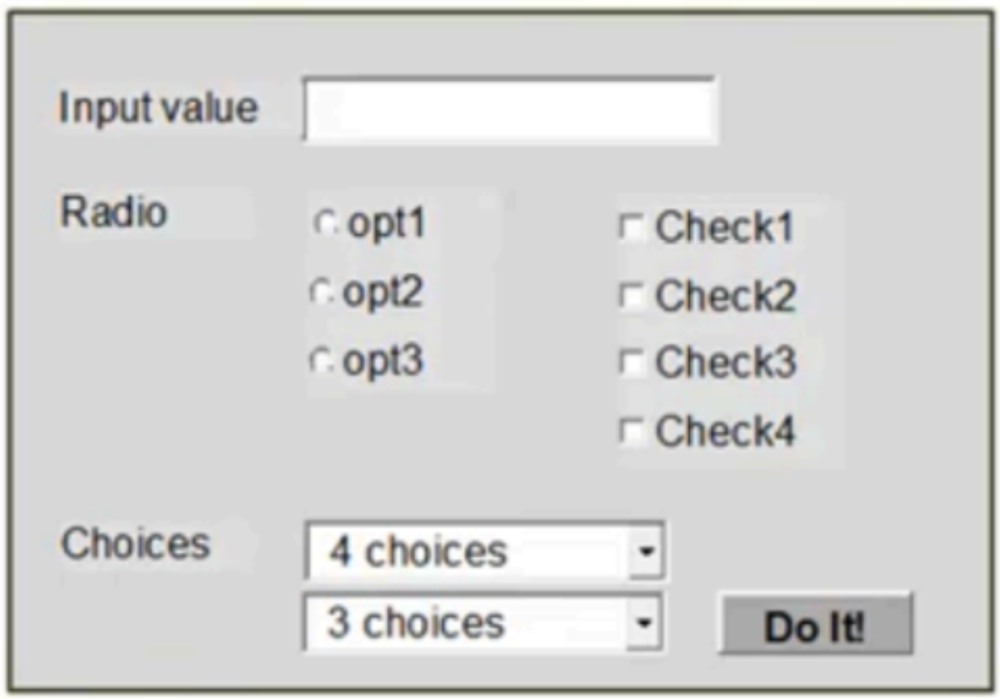

# All-pairs testing technique

## About the tool

-  AllPairs [(https://pypi.org/project/allpairspy/)](https://pypi.org/project/allpairspy/)

AllPairs is an open-source test combinations generator written in Python, developed and maintained by MetaCommunications Engineering.

The generator allows one to create a set of tests using the “pairwise combinations” method, reducing the number of combinations of variables into a lesser set that covers most situations.

Pairwise testing, also known as all-pairs testing, is a software testing method that examines every possible combination of pairs of input parameters. This approach is particularly useful when exhaustive testing is impractical due to the large number of potential test cases, and the time it would take to write and execute them.

Advantages:
- The library is open source and free of external dependencies
- Automatically generates a minimal set of test cases that cover all possible pairs of input values, reducing testing time and effort
- It’s easy to use, as getting started only requires installing the package, with no complex setup needed
- The output is deterministic, meaning the same input will always produce the same result, ensuring consistency and repeatability in testing

Disadvantages:
- It doesn’t support constraints between parameters (e.g., "if A = X, then B cannot be Y")
- The format of the output is fixed and cannot be customized through the tool, so manual formatting is required
- Official documentation is minimal, which can make advanced usage or troubleshooting more difficult
- The project hasn’t seen much recent development or feature updates

## Testing combinations

- Form to test:

### Parameters

| Parameters | Values       | Count |
|------------|--------------|-------|
| Radio      | Opt1, Opt2, Opt3 | 3     |
| Check1     | 0, 1         | 2     |
| Check2     | 0, 1         | 2     |
| Check3     | 0, 1         | 2     |
| Check4     | 0, 1         | 2     |
| Choices1   | 1, 2, 3, 4   | 4     |
| Choices2   | 1, 2, 3      | 3     |

### Analysis

- Total amount of Test Cases: 3*2*2*2*2*4*3 = 576
- Total amount of Test Cases including negative cases: > 576 cases

Using AllPairs tool, I got these combinations:

| #  | Radio | Check1 | Check2 | Check3 | Check4 | Choices1 | Choices2 |
|----|--------|--------|--------|--------|--------|-----------|-----------|
| 1  | opt1  | 0      | 0      | 0      | 0      | 1         | 1         |
| 2  | opt2  | 1      | 1      | 1      | 1      | 2         | 1         |
| 3  | opt3  | 1      | 0      | 1      | 0      | 3         | 2         |
| 4  | opt3  | 0      | 1      | 0      | 1      | 4         | 3         |
| 5  | opt2  | 0      | 0      | 0      | 1      | 3         | 2         |
| 6  | opt1  | 1      | 1      | 1      | 0      | 4         | 3         |
| 7  | opt1  | 1      | 1      | 0      | 1      | 1         | 2         |
| 8  | opt2  | 0      | 0      | 1      | 0      | 2         | 3         |
| 9  | opt3  | 0      | 0      | 1      | 0      | 1         | 3         |
| 10 | opt3  | 0      | 0      | 0      | 0      | 2         | 2         |
| 11 | opt2  | 0      | 0      | 0      | 0      | 4         | 2         |
| 12 | opt1  | 0      | 1      | 0      | 0      | 3         | 3         |
| 13 | opt1  | 0      | 0      | 0      | 0      | 2         | 3         |
| 14 | opt2  | 0      | 0      | 0      | 0      | 1         | 3         |
| 15 | opt3  | 0      | 0      | 0      | 0      | 3         | 1         |
| 16 | opt3  | 0      | 0      | 0      | 0      | 4         | 1         |

This results in only 16 test cases to execute, achieving an approximate reduction of 97.22% in the total number of test cases.

