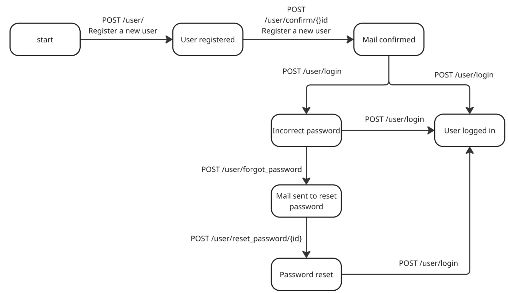

# State transition testing - API app

- **App:** Noctuasky [(https://api.noctuasky.com/api/v1/swaggerdoc/#/)](https://api.noctuasky.com/api/v1/swaggerdoc/#/)
- **Scenario:** User registration and log in

## State chart

## Test cases

### User registration

- Verify that a new user can successfully register using the POST /user/ endpoint
- Verify that registration fails when attempting to use an email that already exists via the POST /user/ endpoint
- Verify that registration fails when providing an invalid email format via the POST /user/ endpoint
- Verify that registration fails when required fields are missing via the POST /user/ endpoint
- Verify that registration fails or warns when a weak password is provided via the POST /user/ endpoint
- Verify that a user registered through POST /user/ receives a confirmation email

#### Mail confirmation
- Verify that a registered user can confirm their email via the POST /user/confirm/{id} endpoint with a valid ID
- Verify that email confirmation fails when an invalid or expired ID is used via the POST /user/confirm/{id} endpoint
- Verify that attempting to confirm an already confirmed email via POST /user/confirm/{id} behaves as expected (e.g., no change, informative message)

### User login
- Verify that a confirmed user can successfully log in using the POST /user/login endpoint with correct credentials
- Verify that login fails when an incorrect password is provided via the POST /user/login endpoint
- Verify that login fails when attempting to log in with a non-existent user via the POST /user/login endpoint
- Verify that login fails for an unconfirmed user account via the POST /user/login endpoint
- Verify that login fails when missing required credentials (e.g., email or password) via the POST /user/login endpoint
- Verify the system's behavior (e.g., account lockout) after multiple incorrect login attempts via the POST /user/login endpoint

### Password reset
- Verify that a password reset email can be requested for an existing user via the POST /user/forgot_password endpoint
- Verify that a password reset request for a non-existent user via the POST /user/forgot_password endpoint handles gracefully (e.g., no email sent, generic message)
- Verify that a user can successfully reset their password using a valid ID via the POST /user/reset_password/{id} endpoint
- Verify that password reset fails when an invalid or expired ID is used via the POST /user/reset_password/{id} endpoint
- Verify that password reset fails when new password and confirmation do not match via the POST /user/reset_password/{id} endpoint
- Verify that password reset prevents reusing the old password via the POST /user/reset_password/{id} endpoint (if applicable)
- Verify that a user can successfully log in immediately after a successful password reset

### Combined scenarios
- Verify that an unconfirmed user cannot log in after registration
- Verify the flow: Register user -> Confirm email -> Attempt incorrect login -> Attempt correct login (success)
- Verify the flow: Register user -> Confirm email -> Request password reset -> Successfully reset password -> Log in with new password